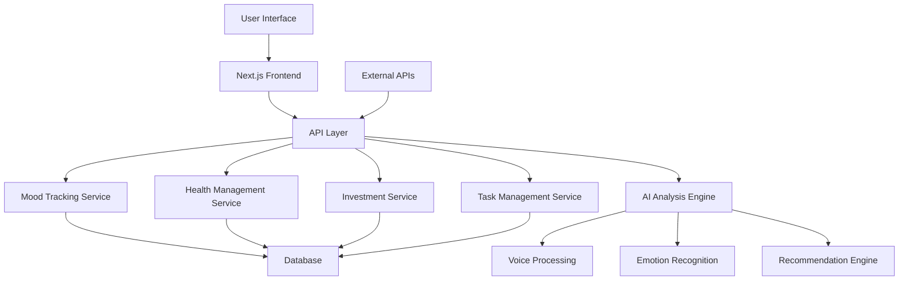
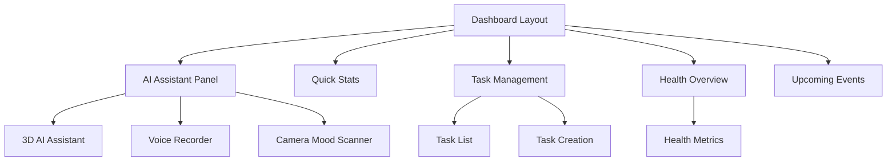

# Life as a Service (LaaS) - AI Assistance Platform Design Document

## 1. Overview

### 1.1 Purpose
The Life as a Service (LaaS) platform is a comprehensive AI-powered assistance system that integrates multiple life management domains into a single unified interface. The platform provides intelligent support for mood tracking, health management, investment guidance, and task organization through advanced AI capabilities.

### 1.2 Scope
This document outlines the architectural design and core components of the LaaS platform, focusing on its multi-domain assistance capabilities. The platform encompasses:

- Mood and emotional intelligence tracking with AI analysis
- Health and wellness management
- Investment and financial planning tools
- Task and productivity management
- AI-powered voice and visual interaction systems

### 1.3 Key Features
- Multi-domain life management in a single platform
- Advanced AI assistant with 3D visualization
- Voice-based interaction and task creation
- Facial emotion recognition for mood tracking
- Personalized recommendations and insights
- Real-time analytics and trend analysis

## 2. Architecture

### 2.1 System Overview
The LaaS platform follows a modern full-stack architecture with a Next.js frontend and API-based backend services. The system is organized into modular domains that can be independently scaled while maintaining tight integration through shared data models and AI services.

### 2.2 Technology Stack
- **Frontend**: Next.js, React, TypeScript, Tailwind CSS
- **3D Visualization**: Three.js, React Three Fiber
- **UI Components**: Radix UI, Shadcn UI
- **State Management**: React Context API
- **API Communication**: Axios
- **Authentication**: JWT-based token system
- **Database**: (Implementation-specific, currently using mock data)

### 2.3 Core Components

#### 2.3.1 AI Assistant Core
The central AI assistant component provides the primary interface for user interaction. It features:
- 3D animated visualization using Three.js
- Voice command processing
- Facial emotion recognition
- Context-aware responses

#### 2.3.2 Domain Services
Each life management domain is implemented as a separate service:
- Mood Tracking Service
- Health Management Service
- Investment Service
- Task Management Service

#### 2.3.3 AI Analysis Engine
The AI engine provides intelligent processing capabilities:
- Natural Language Processing for voice commands
- Emotion analysis from text and facial recognition
- Pattern detection and trend analysis
- Personalized recommendation generation

## 3. API Endpoints Reference

### 3.1 Authentication
| Endpoint | Method | Description |
|----------|--------|-------------|
| `/api/auth/login` | POST | User authentication |
| `/api/auth/signup` | POST | User registration |
| `/api/auth/refresh` | POST | Token refresh |

### 3.2 Mood Analysis
| Endpoint | Method | Description |
|----------|--------|-------------|
| `/api/mood-analysis` | POST | Analyze mood from text input |
| `/api/mood-analysis` | GET | Retrieve mood analytics |

### 3.3 Tasks
| Endpoint | Method | Description |
|----------|--------|-------------|
| `/api/tasks` | GET | Retrieve user tasks |
| `/api/tasks` | POST | Create new task |
| `/api/tasks/{id}` | PUT | Update task |
| `/api/tasks/{id}` | DELETE | Delete task |
| `/api/tasks/create-from-voice` | POST | Create task from voice input |

### 3.4 Moods
| Endpoint | Method | Description |
|----------|--------|-------------|
| `/api/moods` | GET | Retrieve mood entries |
| `/api/moods` | POST | Create new mood entry |
| `/api/moods/user/{userId}` | GET | Retrieve moods for specific user |

## 4. Data Models

### 4.1 User Model
| Field | Type | Description |
|-------|------|-------------|
| id | number | Unique user identifier |
| email | string | User email address |
| name | string | User's full name |
| createdAt | Date | Account creation timestamp |

### 4.2 Mood Entry Model
| Field | Type | Description |
|-------|------|-------------|
| id | number | Unique mood entry identifier |
| userId | number | Associated user identifier |
| moodScore | number | Mood rating (1-10) |
| audioTranscript | string | Voice recording transcript |
| aiAnalysis | string | AI-generated analysis |
| recordedAt | Date | Entry creation timestamp |

### 4.3 Task Model
| Field | Type | Description |
|-------|------|-------------|
| id | number | Unique task identifier |
| title | string | Task title |
| description | string | Detailed task description |
| completed | boolean | Completion status |
| priority | string | Priority level (LOW/MEDIUM/HIGH) |
| dueDate | Date | Task deadline |
| voiceTranscript | string | Voice input transcript |

### 4.4 Health Metrics Model
| Field | Type | Description |
|-------|------|-------------|
| steps | object | Daily step count (current/goal) |
| water | object | Water intake tracking |
| sleep | object | Sleep quality metrics |
| mood | object | Mood tracking data |

## 5. Business Logic Layer

### 5.1 Mood Tracking and Analysis
The mood tracking system provides emotional intelligence capabilities through multiple input methods:

#### 5.1.1 Voice-Based Mood Analysis
- Users can record voice entries to express their current emotional state
- Speech-to-text conversion processes the audio input
- AI analysis engine evaluates sentiment and emotional indicators
- Derived mood scores are generated based on linguistic patterns

#### 5.1.2 Facial Emotion Recognition
- Camera-based emotion detection through facial analysis
- Real-time mood assessment with confidence scoring
- Integration with mood tracking history for pattern analysis

#### 5.1.3 Mood Insights and Recommendations
- Pattern detection in mood history data
- Trigger identification for emotional fluctuations
- Personalized recommendations for emotional well-being
- Predictive mood analysis for future emotional states

### 5.2 Task Management
The task management system enables users to organize their activities through multiple interfaces:

#### 5.2.1 Voice Task Creation
- Natural language processing converts voice commands to tasks
- Automatic due date and priority assignment
- Integration with calendar and scheduling systems

#### 5.2.2 Task Organization
- Priority-based task sorting
- Completion tracking and progress monitoring
- Integration with other life management domains

### 5.3 Health Management
The health management system tracks key wellness metrics:

#### 5.3.1 Activity Tracking
- Step counting and goal monitoring
- Exercise activity logging
- Integration with wearable devices

#### 5.3.2 Wellness Monitoring
- Sleep pattern analysis
- Hydration tracking
- Mood correlation with health metrics

### 5.4 Investment Management (Planned)
The investment management system will provide financial planning capabilities:

#### 5.4.1 Portfolio Tracking
- Asset allocation monitoring
- Performance analysis
- Risk assessment

#### 5.4.2 Financial Insights
- Spending pattern analysis
- Savings recommendations
- Investment opportunity identification

## 6. Middleware and Interceptors

### 6.1 Authentication Middleware
- JWT token validation for API requests
- Automatic token refresh mechanism
- Unauthorized access handling and redirection

### 6.2 API Response Interceptors
- Standardized response formatting
- Error handling and user-friendly messaging
- Performance monitoring and logging

### 6.3 Data Validation
- Input validation for all API endpoints
- Data sanitization to prevent injection attacks
- Schema validation for data integrity

## 7. User Interface Architecture

### 7.1 Component Hierarchy
The UI follows a modular component architecture with reusable elements:

### 7.2 Key UI Components

#### 7.2.1 AI Assistant 3D Visualization
- Interactive 3D model with dynamic animations
- Orbital rings and particle effects
- Energy field visualization
- Holographic interface elements

#### 7.2.2 Voice Interaction System
- Microphone access management
- Audio level visualization
- Speech-to-text processing
- Real-time feedback during recording

#### 7.2.3 Mood Tracking Interface
- Mood score input slider
- Historical mood visualization
- Emotional analysis dashboard
- AI insights presentation

#### 7.2.4 Task Management UI
- Task creation and editing forms
- Priority-based organization
- Completion tracking
- Voice command integration

## 8. AI and Machine Learning Integration

### 8.1 Natural Language Processing
- Voice-to-text conversion for user inputs
- Sentiment analysis for emotional content
- Task extraction from natural language

### 8.2 Computer Vision
- Facial emotion recognition
- Real-time mood assessment
- Confidence scoring for detections

### 8.3 Recommendation Engine
- Pattern detection in user behavior
- Personalized suggestion generation
- Predictive analytics for future states

### 8.4 Data Analysis
- Trend identification across domains
- Correlation analysis between metrics
- Anomaly detection for unusual patterns

## 9. Security and Privacy

### 9.1 Data Protection
- JWT-based authentication system
- Encrypted storage of sensitive information
- Secure API communication

### 9.2 Privacy Controls
- User-controlled data sharing
- Opt-in for analytics and insights
- Data deletion and export capabilities

### 9.3 Access Management
- Role-based access control
- Session management and timeout
- Multi-factor authentication support

## 10. Performance and Scalability

### 10.1 Optimization Strategies
- Client-side caching for improved responsiveness
- Lazy loading for non-critical components
- Code splitting for efficient bundle management

### 10.2 Scalability Considerations
- Microservice architecture for domain separation
- Database optimization for high-volume data
- CDN integration for static asset delivery

## 11. Testing Strategy

### 11.1 Unit Testing
- Component-level testing for UI elements
- API endpoint validation
- Business logic verification

### 11.2 Integration Testing
- Cross-domain data flow validation
- API integration testing
- Third-party service integration

### 11.3 User Experience Testing
- Usability testing for voice interactions
- Accessibility compliance verification
- Performance benchmarking

## 12. Future Enhancements

### 12.1 Advanced AI Capabilities
- Enhanced natural language understanding
- Improved emotion recognition accuracy
- Predictive analytics for life events

### 12.2 Expanded Domain Integration
- Career development tracking
- Relationship management tools
- Learning and skill development systems

### 12.3 Mobile and Desktop Applications
- Native mobile app development
- Desktop application with system integration
- Cross-platform synchronization